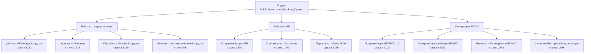
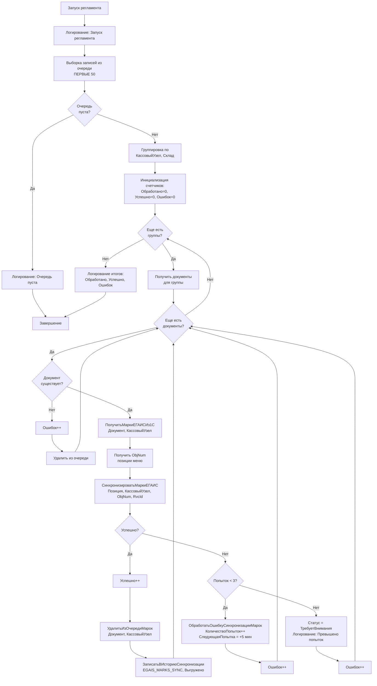
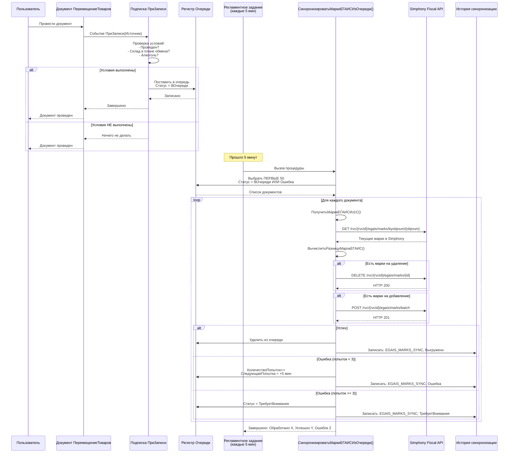
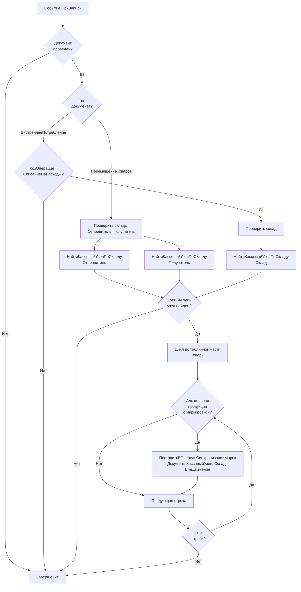

# План имплементации автоматической синхронизации марок ЕГАИС в Simphony

## Оглавление
- [1. Анализ существующего кода](#1-анализ-существующего-кода)
- [2. Детальная спецификация функций](#2-детальная-спецификация-функций)
- [3. Вспомогательные функции](#3-вспомогательные-функции)
- [4. Интеграция с документами](#4-интеграция-с-документами)
- [5. Регламентное задание](#5-регламентное-задание)
- [6. Последовательность имплементации](#6-последовательность-имплементации)
- [7. Проверки и валидация](#7-проверки-и-валидация)

---

## 1. Анализ существующего кода

### 1.1. Архитектура модуля `MRS_ИнтеграцияSimphonyСервер`

**Файл**: `d:\1c\MRS_HRS\CommonModules\MRS_ИнтеграцияSimphonyСервер\Ext\Module.bsl`

Модуль уже содержит инфраструктуру для работы с очередями и ЕГАИС:



### 1.2. Существующие функции для переиспользования

| Функция | Строка | Назначение | Использование |
|---------|--------|-----------|---------------|
| **`ПолучитьМаркиЕГАИСИз1С()`** | 2108 | Получение марок из регистра `ТоварыНаСкладах` + `АкцизныеМаркиЕГАИС` | Использовать в регламентном задании для получения текущего состояния марок |
| **`СинхронизироватьМаркиЕГАИС()`** | 2391 | Двусторонняя синхронизация марок с Simphony через REST API | Основная функция для синхронизации, вызывается из регламента |
| **`ОтправитьЗапросAPI()`** | 1310 | HTTP взаимодействие с Simphony API | Переиспользуется автоматически через `СинхронизироватьМаркиЕГАИС()` |
| **`ДобавитьВОчередьВыгрузки()`** | 1163 | Постановка записи в очередь | Паттерн для создания аналогичной функции для марок |
| **`УдалитьИзОчереди()`** | 1278 | Удаление успешно обработанной записи | Паттерн для удаления из очереди марок |
| **`ОбработатьОшибкуВыгрузки()`** | 1215 | Обработка ошибок с увеличением счетчика попыток | Паттерн для обработки ошибок синхронизации марок |
| **`ЗаписатьВИсториюСинхронизации()`** | 1698 | Логирование операций | Используется для записи истории синхронизации марок |

### 1.3. Паттерн работы с очередью (из выгрузки меню)

**Функция**: `ВыполнитьАвтоматическуюВыгрузку()` (строка 58-123)

Ключевые элементы паттерна:

```bsl
// 1. Выборка из очереди с ограничением
Запрос.Текст = 
    "ВЫБРАТЬ ПЕРВЫЕ 50
    |   Очередь.ПозицияМеню,
    |   Очередь.КассовыйУзел,
    |   ...
    |ИЗ
    |   РегистрСведений.MRS_ОчередьВыгрузкиМенюSimphony КАК Очередь
    |ГДЕ
    |   (Очередь.Статус = ЗНАЧЕНИЕ(...ВОчереди)
    |        ИЛИ Очередь.Статус = ЗНАЧЕНИЕ(...Ошибка)
    |            И Очередь.КоличествоПопыток < 3
    |            И (Очередь.СледующаяПопытка = ДАТАВРЕМЯ(1, 1, 1)
    |                ИЛИ Очередь.СледующаяПопытка <= &ТекущаяДата))";

// 2. Группировка по узлам для bulk-операций
ТаблицаОчереди.Свернуть("КассовыйУзел", "");

// 3. Обработка каждого узла
Для Каждого СтрокаУзла Из ТаблицаОчереди Цикл
    РезультатВыгрузки = ВыгрузитьПакетПозиций(МассивПозиций, СтрокаУзла.КассовыйУзел);
    ВсегоОбработано = ВсегоОбработано + РезультатВыгрузки.Обработано;
КонецЦикла;
```

**Адаптация паттерна для марок**:
- Вместо `ПозицияМеню` → `Документ`
- Группировка по `КассовыйУзел` + `Склад`
- Вызов `СинхронизироватьМаркиЕГАИС()` для каждого документа

### 1.4. План обмена `питУдаленныеКассы`

**Реквизиты узла**:
- `СкладРеализации` - склад Simphony
- `Префикс` - код узла (RvcId) для API
- `ВидЦен` - вид цен для определения позиций меню

**Использование в функциях**:

```bsl
// Получение склада реализации
СкладРеализации = ОбщегоНазначения.ЗначениеРеквизитаОбъекта(КассовыйУзел, "СкладРеализации");

// Получение RvcId для API
RvcId = Число(СокрЛП(ОбщегоНазначения.ЗначениеРеквизитаОбъекта(КассовыйУзел, "Префикс")));
```

---

## 2. Детальная спецификация функций

### 2.1. Функция `СинхронизироватьМаркиЕГАИСИзОчереди()` (регламентное задание)

**Расположение**: Строка 1909  
**Сигнатура**: `Процедура СинхронизироватьМаркиЕГАИСИзОчереди() Экспорт`

#### Алгоритм работы (пошагово)



#### Структура запроса для выборки из очереди

```bsl
Запрос = Новый Запрос;
Запрос.Текст =
    "ВЫБРАТЬ ПЕРВЫЕ 50
    |    Очередь.Документ КАК Документ,
    |    Очередь.КассовыйУзел КАК КассовыйУзел,
    |    Очередь.Склад КАК Склад,
    |    Очередь.ВидДвижения КАК ВидДвижения,
    |    Очередь.КоличествоПопыток КАК КоличествоПопыток,
    |    Очередь.ДатаПостановкиВОчередь КАК ДатаПостановкиВОчередь
    |ИЗ
    |    РегистрСведений.MRS_ОчередьСинхронизацииМарокЕГАИС КАК Очередь
    |ГДЕ
    |    (Очередь.Статус = ЗНАЧЕНИЕ(Перечисление.MRS_СтатусыСинхронизацииSimphony.ВОчереди)
    |        ИЛИ Очередь.Статус = ЗНАЧЕНИЕ(Перечисление.MRS_СтатусыСинхронизацииSimphony.Ошибка)
    |            И Очередь.КоличествоПопыток < 3
    |            И (Очередь.СледующаяПопытка = ДАТАВРЕМЯ(1, 1, 1)
    |                ИЛИ Очередь.СледующаяПопытка <= &ТекущаяДата))
    |
    |УПОРЯДОЧИТЬ ПО
    |    Очередь.ДатаПостановкиВОчередь";

Запрос.УстановитьПараметр("ТекущаяДата", ТекущаяДатаСеанса());

РезультатЗапроса = Запрос.Выполнить();

Если РезультатЗапроса.Пустой() Тогда
    ЗаписьЖурналаРегистрации("MRS.Simphony.EGAIS.Marks", 
        УровеньЖурналаРегистрации.Информация,,,
        "Очередь синхронизации марок ЕГАИС пуста");
    Возврат;
КонецЕсли;
```

#### Обработка каждой записи

```bsl
ТаблицаОчереди = РезультатЗапроса.Выгрузить();

// Группировка по кассовым узлам
ТаблицаОчереди.Свернуть("КассовыйУзел", "");

ВсегоОбработано = 0;
ВсегоУспешно = 0;
ВсегоОшибок = 0;

Для Каждого СтрокаУзла Из ТаблицаОчереди Цикл
    
    // Получаем документы для данного узла
    Отбор = Новый Структура("КассовыйУзел", СтрокаУзла.КассовыйУзел);
    МассивДокументов = ТаблицаОчереди.НайтиСтроки(Отбор);
    
    Для Каждого СтрокаДокумента Из МассивДокументов Цикл
        
        ВсегоОбработано = ВсегоОбработано + 1;
        
        Попытка
            
            // Валидация: проверка существования документа
            Если НЕ ЗначениеЗаполнено(СтрокаДокумента.Документ) Тогда
                
                ВсегоОшибок = ВсегоОшибок + 1;
                УдалитьИзОчередиМарок(СтрокаДокумента.Документ, СтрокаУзла.КассовыйУзел);
                Продолжить;
                
            КонецЕсли;
            
            // Получение марок из 1С
            Номенклатура = ОпределитьНоменклатуруПоДокументу(СтрокаДокумента.Документ, СтрокаДокумента.Склад);
            
            Если НЕ ЗначениеЗаполнено(Номенклатура) Тогда
                
                ТекстОшибки = "Не удалось определить номенклатуру для синхронизации марок";
                ОбработатьОшибкуСинхронизацииМарок(СтрокаДокумента.Документ, СтрокаУзла.КассовыйУзел, 0, ТекстОшибки);
                ВсегоОшибок = ВсегоОшибок + 1;
                Продолжить;
                
            КонецЕсли;
            
            // Получение марок ЕГАИС из 1С
            Марки1С = ПолучитьМаркиЕГАИСИз1С(Номенклатура, СтрокаУзла.КассовыйУзел);
            
            // Получение позиции меню
            ПозицияМеню = НайтиПозициюМенюПоНоменклатуре(Номенклатура, СтрокаУзла.КассовыйУзел);
            
            Если НЕ ЗначениеЗаполнено(ПозицияМеню) Тогда
                
                ТекстОшибки = "Не найдена позиция меню для номенклатуры";
                ОбработатьОшибкуСинхронизацииМарок(СтрокаДокумента.Документ, СтрокаУзла.КассовыйУзел, 0, ТекстОшибки);
                ВсегоОшибок = ВсегоОшибок + 1;
                Продолжить;
                
            КонецЕсли;
            
            ДанныеПозиции = ПолучитьДанныеПозицииЕГАИС(ПозицияМеню);
            ObjNum = ДанныеПозиции.ObjNum;
            
            // Получение RvcId
            RvcId = Число(СокрЛП(ОбщегоНазначения.ЗначениеРеквизитаОбъекта(СтрокаУзла.КассовыйУзел, "Префикс")));
            
            // Синхронизация марок
            РезультатСинхронизации = СинхронизироватьМаркиЕГАИС(ПозицияМеню, СтрокаУзла.КассовыйУзел, ObjNum, RvcId);
            
            Если РезультатСинхронизации.Успешно Тогда
                
                // Успешная синхронизация
                УдалитьИзОчередиМарок(СтрокаДокумента.Документ, СтрокаУзла.КассовыйУзел);
                ВсегоУспешно = ВсегоУспешно + 1;
                
                // Логирование
                ЗаписьЖурналаРегистрации("MRS.Simphony.EGAIS.Marks",
                    УровеньЖурналаРегистрации.Информация,
                    ,
                    СтрокаДокумента.Документ,
                    СтрШаблон("Марки синхронизированы: добавлено %1, удалено %2", 
                        РезультатСинхронизации.Добавлено, 
                        РезультатСинхронизации.Удалено));
                
            Иначе
                
                // Ошибка синхронизации
                ОбработатьОшибкуСинхронизацииМарок(СтрокаДокумента.Документ, СтрокаУзла.КассовыйУзел, 0, РезультатСинхронизации.Сообщение);
                ВсегоОшибок = ВсегоОшибок + 1;
                
            КонецЕсли;
            
        Исключение
            
            ТекстОшибки = ПодробноеПредставлениеОшибки(ИнформацияОбОшибке());
            ОбработатьОшибкуСинхронизацииМарок(СтрокаДокумента.Документ, СтрокаУзла.КассовыйУзел, 0, ТекстОшибки);
            ВсегоОшибок = ВсегоОшибок + 1;
            
        КонецПопытки;
        
    КонецЦикла;
    
КонецЦикла;

// Итоговое логирование
ЗаписьЖурналаРегистрации("MRS.Simphony.EGAIS.Marks",
    УровеньЖурналаРегистрации.Информация,,,
    СтрШаблон("Обработка завершена. Обработано: %1, Успешно: %2, Ошибок: %3",
        ВсегоОбработано, ВсегоУспешно, ВсегоОшибок));
```

#### Вызовы существующих функций

| Этап | Функция | Назначение |
|------|---------|-----------|
| Получение марок из 1С | `ПолучитьМаркиЕГАИСИз1С(Номенклатура, КассовыйУзел)` | Строка 2108 |
| Синхронизация марок | `СинхронизироватьМаркиЕГАИС(Позиция, КассовыйУзел, ObjNum, RvcId)` | Строка 2391 |
| Удаление из очереди | `УдалитьИзОчередиМарок(Документ, КассовыйУзел)` | Новая функция (см. раздел 3.3) |
| Обработка ошибки | `ОбработатьОшибкуСинхронизацииМарок(Документ, КассовыйУзел, HTTPСтатус, ТекстОшибки)` | Новая функция (см. раздел 3.4) |

#### Обработка успешного выполнения

```bsl
// Удаление из очереди
УдалитьИзОчередиМарок(Документ, КассовыйУзел);

// Логирование успеха
ЗаписьЖурналаРегистрации("MRS.Simphony.EGAIS.Marks",
    УровеньЖурналаРегистрации.Информация,
    ,
    Документ,
    СтрШаблон("Марки синхронизированы: добавлено %1, удалено %2",
        РезультатСинхронизации.Добавлено,
        РезультатСинхронизации.Удалено));
```

#### Обработка ошибок с повторными попытками

```bsl
Процедура ОбработатьОшибкуСинхронизацииМарок(Документ, КассовыйУзел, HTTPСтатус, ТекстОшибки)
    
    УстановитьПривилегированныйРежим(Истина);
    
    НаборЗаписей = РегистрыСведений.MRS_ОчередьСинхронизацииМарокЕГАИС.СоздатьНаборЗаписей();
    НаборЗаписей.Отбор.Документ.Установить(Документ);
    НаборЗаписей.Отбор.КассовыйУзел.Установить(КассовыйУзел);
    НаборЗаписей.Прочитать();
    
    Если НаборЗаписей.Количество() = 0 Тогда
        Возврат;
    КонецЕсли;
    
    Запись = НаборЗаписей[0];
    Запись.КоличествоПопыток = Запись.КоличествоПопыток + 1;
    Запись.СтрокаОшибки = Лев(ТекстОшибки, 500);
    
    Если Запись.КоличествоПопыток >= 3 Тогда
        
        // Превышено количество попыток
        Запись.Статус = Перечисления.MRS_СтатусыСинхронизацииSimphony.ТребуетВнимания;
        Запись.СледующаяПопытка = Дата(1, 1, 1);
        
        // Логирование критической ошибки
        ЗаписьЖурналаРегистрации("MRS.Simphony.EGAIS.Marks",
            УровеньЖурналаРегистрации.Ошибка,
            ,
            Документ,
            СтрШаблон("Превышено количество попыток синхронизации марок: %1", ТекстОшибки));
        
    Иначе
        
        // Запланировать следующую попытку через 5 минут
        Запись.Статус = Перечисления.MRS_СтатусыСинхронизацииSimphony.Ошибка;
        Запись.СледующаяПопытка = ТекущаяДатаСеанса() + 300; // +5 минут
        
    КонецЕсли;
    
    НаборЗаписей.Записать();
    
    УстановитьПривилегированныйРежим(Ложь);
    
КонецПроцедуры
```

---

### 2.2. Функция `ПриЗаписиДокументовДвиженияМарок()` (для подписок)

**Расположение**: Строка 1917  
**Сигнатура**: `Процедура ПриЗаписиДокументовДвиженияМарок(Источник) Экспорт`

#### Входные параметры

| Параметр | Тип | Описание |
|----------|-----|----------|
| `Источник` | `ДокументОбъект.ПеремещениеТоваров` или `ДокументОбъект.ВнутреннееПотребление` | Документ-источник события |

Процедура будет вызываться из подписок на события документов:
- `Документ.ПеремещениеТоваров.ПриЗаписи`
- `Документ.ВнутреннееПотребление.ПриЗаписи`

#### Логика определения типа документа

```bsl
Процедура ПриЗаписиДокументовДвиженияМарок(Источник) Экспорт
    
    // Проверка проведения
    Если НЕ Источник.Проведен Тогда
        Возврат;
    КонецЕсли;
    
    // Определение типа документа
    ТипДокумента = ТипЗнч(Источник);
    
    Если ТипДокумента = Тип("ДокументОбъект.ПеремещениеТоваров") Тогда
        
        ОбработатьПеремещениеТоваров(Источник);
        
    ИначеЕсли ТипДокумента = Тип("ДокументОбъект.ВнутреннееПотребление") Тогда
        
        ОбработатьВнутреннееПотребление(Источник);
        
    КонецЕсли;
    
КонецПроцедуры
```

#### Проверка условий для постановки в очередь

**Для ПеремещениеТоваров**:

```bsl
Процедура ОбработатьПеремещениеТоваров(Документ)
    
    // Проверка складов на принадлежность к плану обмена
    КассовыйУзелПолучатель = НайтиКассовыйУзелПоСкладу(Документ.СкладПолучатель);
    КассовыйУзелОтправитель = НайтиКассовыйУзелПоСкладу(Документ.Склад);
    
    // Если ни один склад не в плане обмена - выход
    Если НЕ ЗначениеЗаполнено(КассовыйУзелПолучатель) И НЕ ЗначениеЗаполнено(КассовыйУзелОтправитель) Тогда
        Возврат;
    КонецЕсли;
    
    // Обработка табличной части
    Для Каждого СтрокаТовара Из Документ.Товары Цикл
        
        // Проверка на алкогольную продукцию
        Если НЕ ЭтоАлкогольнаяПродукцияСМаркировкой(СтрокаТовара.Номенклатура) Тогда
            Продолжить;
        КонецЕсли;
        
        // Постановка в очередь для склада получателя (Приход)
        Если ЗначениеЗаполнено(КассовыйУзелПолучатель) Тогда
            
            ПоставитьВОчередьСинхронизацииМарок(
                Документ.Ссылка,
                КассовыйУзелПолучатель,
                Документ.СкладПолучатель,
                Перечисления.ВидыДвиженияНакопления.Приход);
            
        КонецЕсли;
        
        // Постановка в очередь для склада отправителя (Расход)
        Если ЗначениеЗаполнено(КассовыйУзелОтправитель) Тогда
            
            ПоставитьВОчередьСинхронизацииМарок(
                Документ.Ссылка,
                КассовыйУзелОтправитель,
                Документ.Склад,
                Перечисления.ВидыДвиженияНакопления.Расход);
            
        КонецЕсли;
        
    КонецЦикла;
    
КонецПроцедуры
```

**Для ВнутреннееПотребление**:

```bsl
Процедура ОбработатьВнутреннееПотребление(Документ)
    
    // Проверка хозяйственной операции
    Если Документ.ХозяйственнаяОперация <> Перечисления.ХозяйственныеОперации.СписаниеНаРасходы Тогда
        Возврат;
    КонецЕсли;
    
    // Проверка склада на принадлежность к плану обмена
    КассовыйУзел = НайтиКассовыйУзелПоСкладу(Документ.Склад);
    
    Если НЕ ЗначениеЗаполнено(КассовыйУзел) Тогда
        Возврат;
    КонецЕсли;
    
    // Обработка табличной части
    Для Каждого СтрокаТовара Из Документ.Товары Цикл
        
        // Проверка на алкогольную продукцию
        Если НЕ ЭтоАлкогольнаяПродукцияСМаркировкой(СтрокаТовара.Номенклатура) Тогда
            Продолжить;
        КонецЕсли;
        
        // Постановка в очередь для склада (Расход)
        ПоставитьВОчередьСинхронизацииМарок(
            Документ.Ссылка,
            КассовыйУзел,
            Документ.Склад,
            Перечисления.ВидыДвиженияНакопления.Расход);
        
    КонецЦикла;
    
КонецПроцедуры
```

#### Определение кассового узла

```bsl
Функция НайтиКассовыйУзелПоСкладу(Склад)
    
    Если НЕ ЗначениеЗаполнено(Склад) Тогда
        Возврат Неопределено;
    КонецЕсли;
    
    Запрос = Новый Запрос;
    Запрос.Текст =
        "ВЫБРАТЬ ПЕРВЫЕ 1
        |    питУдаленныеКассы.Ссылка КАК КассовыйУзел
        |ИЗ
        |    ПланОбмена.питУдаленныеКассы КАК питУдаленныеКассы
        |ГДЕ
        |    питУдаленныеКассы.СкладРеализации = &Склад";
    
    Запрос.УстановитьПараметр("Склад", Склад);
    
    РезультатЗапроса = Запрос.Выполнить();
    
    Если РезультатЗапроса.Пустой() Тогда
        Возврат Неопределено;
    КонецЕсли;
    
    Выборка = РезультатЗапроса.Выбрать();
    Выборка.Следующий();
    
    Возврат Выборка.КассовыйУзел;
    
КонецФункции
```

#### Запись в регистр очереди

```bsl
Процедура ПоставитьВОчередьСинхронизацииМарок(Документ, КассовыйУзел, Склад, ВидДвижения)
    
    УстановитьПривилегированныйРежим(Истина);
    
    НаборЗаписей = РегистрыСведений.MRS_ОчередьСинхронизацииМарокЕГАИС.СоздатьНаборЗаписей();
    НаборЗаписей.Отбор.Документ.Установить(Документ);
    НаборЗаписей.Отбор.КассовыйУзел.Установить(КассовыйУзел);
    
    Запись = НаборЗаписей.Добавить();
    Запись.Документ = Документ;
    Запись.КассовыйУзел = КассовыйУзел;
    Запись.Склад = Склад;
    Запись.ВидДвижения = ВидДвижения;
    Запись.Статус = Перечисления.MRS_СтатусыСинхронизацииSimphony.ВОчереди;
    Запись.ДатаПостановкиВОчередь = ТекущаяДатаСеанса();
    Запись.КоличествоПопыток = 0;
    Запись.СледующаяПопытка = Дата(1, 1, 1);
    Запись.СтрокаОшибки = "";
    
    НаборЗаписей.Записать();
    
    УстановитьПривилегированныйРежим(Ложь);
    
КонецПроцедуры
```

---

## 3. Вспомогательные функции

### 3.1. Функция `НайтиКассовыйУзелПоСкладу(Склад)`

**Назначение**: Поиск узла плана обмена `питУдаленныеКассы` по складу реализации

**Сигнатура**: 
```bsl
Функция НайтиКассовыйУзелПоСкладу(Склад) Экспорт
```

**Параметры**:
- `Склад` - СправочникСсылка.Склады

**Возвращаемое значение**:
- `ПланОбменаСсылка.питУдаленныеКассы` или `Неопределено`

**Реализация**: См. раздел 2.2, "Определение кассового узла"

---

### 3.2. Функция `ОпределитьВидДвиженияМарок(Документ, Склад)`

**Назначение**: Определение вида движения марок (Приход/Расход) на основе типа документа и склада

**Сигнатура**:
```bsl
Функция ОпределитьВидДвиженияМарок(Документ, Склад) Экспорт
```

**Параметры**:
- `Документ` - ДокументСсылка.*
- `Склад` - СправочникСсылка.Склады

**Возвращаемое значение**:
- `ПеречислениеСсылка.ВидыДвиженияНакопления.Приход` или `.Расход`

**Реализация**:

```bsl
Функция ОпределитьВидДвиженияМарок(Документ, Склад) Экспорт
    
    ТипДокумента = ТипЗнч(Документ);
    
    Если ТипДокумента = Тип("ДокументСсылка.ПеремещениеТоваров") Тогда
        
        // Получение реквизитов документа
        Реквизиты = ОбщегоНазначения.ЗначенияРеквизитовОбъекта(Документ, "Склад, СкладПолучатель");
        
        // Если Склад = СкладОтправитель → Расход
        Если Реквизиты.Склад = Склад Тогда
            Возврат Перечисления.ВидыДвиженияНакопления.Расход;
        КонецЕсли;
        
        // Если Склад = СкладПолучатель → Приход
        Если Реквизиты.СкладПолучатель = Склад Тогда
            Возврат Перечисления.ВидыДвиженияНакопления.Приход;
        КонецЕсли;
        
    ИначеЕсли ТипДокумента = Тип("ДокументСсылка.ВнутреннееПотребление") Тогда
        
        // Всегда расход
        Возврат Перечисления.ВидыДвиженияНакопления.Расход;
        
    КонецЕсли;
    
    // По умолчанию расход
    Возврат Перечисления.ВидыДвиженияНакопления.Расход;
    
КонецФункции
```

---

### 3.3. Функция `УдалитьИзОчередиМарок(Документ, КассовыйУзел)`

**Назначение**: Удаление успешно обработанной записи из очереди синхронизации марок

**Сигнатура**:
```bsl
Процедура УдалитьИзОчередиМарок(Документ, КассовыйУзел) Экспорт
```

**Параметры**:
- `Документ` - ДокументСсылка.*
- `КассовыйУзел` - ПланОбменаСсылка.питУдаленныеКассы

**Реализация** (аналогично `УдалитьИзОчереди()` строка 1278):

```bsl
Процедура УдалитьИзОчередиМарок(Документ, КассовыйУзел) Экспорт
    
    УстановитьПривилегированныйРежим(Истина);
    
    НаборЗаписей = РегистрыСведений.MRS_ОчередьСинхронизацииМарокЕГАИС.СоздатьНаборЗаписей();
    НаборЗаписей.Отбор.Документ.Установить(Документ);
    НаборЗаписей.Отбор.КассовыйУзел.Установить(КассовыйУзел);
    НаборЗаписей.Записать(); // Пустой набор = удаление
    
    УстановитьПривилегированныйРежим(Ложь);
    
КонецПроцедуры
```

---

### 3.4. Функция `ОбработатьОшибкуСинхронизацииМарок(Документ, КассовыйУзел, HTTPСтатус, ТекстОшибки)`

**Назначение**: Обработка ошибки синхронизации с увеличением счетчика попыток и планированием следующей попытки

**Сигнатура**:
```bsl
Процедура ОбработатьОшибкуСинхронизацииМарок(Документ, КассовыйУзел, HTTPСтатус, ТекстОшибки) Экспорт
```

**Параметры**:
- `Документ` - ДокументСсылка.*
- `КассовыйУзел` - ПланОбменаСсылка.питУдаленныеКассы
- `HTTPСтатус` - Число (0 для таймаутов/исключений)
- `ТекстОшибки` - Строка

**Реализация**: См. раздел 2.1, "Обработка ошибок с повторными попытками"

---

### 3.5. Функция `ЭтоАлкогольнаяПродукцияСМаркировкой(Номенклатура)`

**Назначение**: Проверка, является ли номенклатура алкогольной продукцией с обязательной маркировкой

**Сигнатура**:
```bsl
Функция ЭтоАлкогольнаяПродукцияСМаркировкой(Номенклатура) Экспорт
```

**Параметры**:
- `Номенклатура` - СправочникСсылка.Номенклатура

**Возвращаемое значение**:
- `Булево` - Истина, если номенклатура является алкоголем (НЕ во вскрытой таре)

**Реализация**:

```bsl
Функция ЭтоАлкогольнаяПродукцияСМаркировкой(Номенклатура) Экспорт
    
    Если НЕ ЗначениеЗаполнено(Номенклатура) Тогда
        Возврат Ложь;
    КонецЕсли;
    
    Запрос = Новый Запрос;
    Запрос.Текст =
        "ВЫБРАТЬ
        |    Номенклатура.АлкогольнаяПродукция КАК АлкогольнаяПродукция,
        |    Номенклатура.АлкогольнаяПродукцияВоВскрытойТаре КАК ВоВскрытойТаре
        |ИЗ
        |    Справочник.Номенклатура КАК Номенклатура
        |ГДЕ
        |    Номенклатура.Ссылка = &Номенклатура";
    
    Запрос.УстановитьПараметр("Номенклатура", Номенклатура);
    
    Выборка = Запрос.Выполнить().Выбрать();
    
    Если Выборка.Следующий() Тогда
        // Алкоголь НЕ во вскрытой таре требует синхронизации марок
        Возврат Выборка.АлкогольнаяПродукция И НЕ Выборка.ВоВскрытойТаре;
    КонецЕсли;
    
    Возврат Ложь;
    
КонецФункции
```

---

### 3.6. Функция `ОпределитьНоменклатуруПоДокументу(Документ, Склад)`

**Назначение**: Получение номенклатуры из документа для указанного склада

**Сигнатура**:
```bsl
Функция ОпределитьНоменклатуруПоДокументу(Документ, Склад) Экспорт
```

**Параметры**:
- `Документ` - ДокументСсылка.*
- `Склад` - СправочникСсылка.Склады

**Возвращаемое значение**:
- `СправочникСсылка.Номенклатура` или `Неопределено`

**Реализация**:

```bsl
Функция ОпределитьНоменклатуруПоДокументу(Документ, Склад) Экспорт
    
    ТипДокумента = ТипЗнч(Документ);
    
    // Для ПеремещениеТоваров
    Если ТипДокумента = Тип("ДокументСсылка.ПеремещениеТоваров") Тогда
        
        Запрос = Новый Запрос;
        Запрос.Текст =
            "ВЫБРАТЬ ПЕРВЫЕ 1
            |    ПеремещениеТоваровТовары.Номенклатура КАК Номенклатура
            |ИЗ
            |    Документ.ПеремещениеТоваров.Товары КАК ПеремещениеТоваровТовары
            |ГДЕ
            |    ПеремещениеТоваровТовары.Ссылка = &Документ
            |    И ПеремещениеТоваровТовары.Номенклатура.АлкогольнаяПродукция = ИСТИНА
            |    И ПеремещениеТоваровТовары.Номенклатура.АлкогольнаяПродукцияВоВскрытойТаре = ЛОЖЬ";
        
        Запрос.УстановитьПараметр("Документ", Документ);
        
    // Для ВнутреннееПотребление
    ИначеЕсли ТипДокумента = Тип("ДокументСсылка.ВнутреннееПотребление") Тогда
        
        Запрос = Новый Запрос;
        Запрос.Текст =
            "ВЫБРАТЬ ПЕРВЫЕ 1
            |    ВнутреннееПотреблениеТовары.Номенклатура КАК Номенклатура
            |ИЗ
            |    Документ.ВнутреннееПотребление.Товары КАК ВнутреннееПотреблениеТовары
            |ГДЕ
            |    ВнутреннееПотреблениеТовары.Ссылка = &Документ
            |    И ВнутреннееПотреблениеТовары.Номенклатура.АлкогольнаяПродукция = ИСТИНА
            |    И ВнутреннееПотреблениеТовары.Номенклатура.АлкогольнаяПродукцияВоВскрытойТаре = ЛОЖЬ";
        
        Запрос.УстановитьПараметр("Документ", Документ);
        
    Иначе
        Возврат Неопределено;
    КонецЕсли;
    
    РезультатЗапроса = Запрос.Выполнить();
    
    Если РезультатЗапроса.Пустой() Тогда
        Возврат Неопределено;
    КонецЕсли;
    
    Выборка = РезультатЗапроса.Выбрать();
    Выборка.Следующий();
    
    Возврат Выборка.Номенклатура;
    
КонецФункции
```

---

### 3.7. Функция `НайтиПозициюМенюПоНоменклатуре(Номенклатура, КассовыйУзел)`

**Назначение**: Поиск позиции меню по номенклатуре и кассовому узлу

**Сигнатура**:
```bsl
Функция НайтиПозициюМенюПоНоменклатуре(Номенклатура, КассовыйУзел) Экспорт
```

**Параметры**:
- `Номенклатура` - СправочникСсылка.Номенклатура
- `КассовыйУзел` - ПланОбменаСсылка.питУдаленныеКассы

**Возвращаемое значение**:
- `СправочникСсылка.питМеню` или `Неопределено`

**Реализация**:

```bsl
Функция НайтиПозициюМенюПоНоменклатуре(Номенклатура, КассовыйУзел) Экспорт
    
    Если НЕ ЗначениеЗаполнено(Номенклатура) Или НЕ ЗначениеЗаполнено(КассовыйУзел) Тогда
        Возврат Неопределено;
    КонецЕсли;
    
    // Получение вида меню из кассового узла
    Запрос = Новый Запрос;
    Запрос.Текст =
        "ВЫБРАТЬ ПЕРВЫЕ 1
        |    питУдаленныеКассыВидыМеню.ВидМеню КАК ВидМеню
        |ИЗ
        |    ПланОбмена.питУдаленныеКассы.ВидыМеню КАК питУдаленныеКассыВидыМеню
        |ГДЕ
        |    питУдаленныеКассыВидыМеню.Ссылка = &КассовыйУзел";
    
    Запрос.УстановитьПараметр("КассовыйУзел", КассовыйУзел);
    
    РезультатЗапроса = Запрос.Выполнить();
    
    Если РезультатЗапроса.Пустой() Тогда
        Возврат Неопределено;
    КонецЕсли;
    
    Выборка = РезультатЗапроса.Выбрать();
    Выборка.Следующий();
    
    ВидМеню = Выборка.ВидМеню;
    
    // Поиск позиции меню по номенклатуре и виду меню
    ПозицияМеню = Справочники.питМеню.НайтиПоРеквизиту("Номенклатура", Номенклатура, , ВидМеню);
    
    Возврат ПозицияМеню;
    
КонецФункции
```

---

## 4. Интеграция с документами

### 4.1. Подписки на события

Необходимо создать подписки на события для документов `ПеремещениеТоваров` и `ВнутреннееПотребление`.

#### Подписка 1: `MRS_СинхронизацияМарокПриЗаписиПеремещенияТоваров`

**Метаданные**:
- **Имя**: `MRS_СинхронизацияМарокПриЗаписиПеремещенияТоваров`
- **Источник**: `Документ.ПеремещениеТоваров`
- **Событие**: `ПриЗаписи`
- **Обработчик**: `MRS_ИнтеграцияSimphonyСервер.ПриЗаписиДокументовДвиженияМарок`

**XML метаданных** (для справки):

```xml
<Subscription uuid="[guid]">
    <Name>MRS_СинхронизацияМарокПриЗаписиПеремещенияТоваров</Name>
    <Source>
        <Type>DocumentObject.ПеремещениеТоваров</Type>
    </Source>
    <Event>ПриЗаписи</Event>
    <Handler>CommonModule.MRS_ИнтеграцияSimphonyСервер.ServerCall.ПриЗаписиДокументовДвиженияМарок</Handler>
</Subscription>
```

#### Подписка 2: `MRS_СинхронизацияМарокПриЗаписиВнутреннегоПотребления`

**Метаданные**:
- **Имя**: `MRS_СинхронизацияМарокПриЗаписиВнутреннегоПотребления`
- **Источник**: `Документ.ВнутреннееПотребление`
- **Событие**: `ПриЗаписи`
- **Обработчик**: `MRS_ИнтеграцияSimphonyСервер.ПриЗаписиДокументовДвиженияМарок`

**XML метаданных** (для справки):

```xml
<Subscription uuid="[guid]">
    <Name>MRS_СинхронизацияМарокПриЗаписиВнутреннегоПотребления</Name>
    <Source>
        <Type>DocumentObject.ВнутреннееПотребление</Type>
    </Source>
    <Event>ПриЗаписи</Event>
    <Handler>CommonModule.MRS_ИнтеграцияSimphonyСервер.ServerCall.ПриЗаписиДокументовДвиженияМарок</Handler>
</Subscription>
```

### 4.2. Условия срабатывания подписки

| Условие | Проверка |
|---------|----------|
| Документ проведен | `Источник.Проведен = Истина` |
| Склад в плане обмена | `НайтиКассовыйУзелПоСкладу(Склад) <> Неопределено` |
| Алкогольная продукция | `Номенклатура.АлкогольнаяПродукция = Истина` |
| НЕ во вскрытой таре | `Номенклатура.АлкогольнаяПродукцияВоВскрытойТаре = Ложь` |

### 4.3. Особенности

#### Проверка на проведение документа

```bsl
Если НЕ Источник.Проведен Тогда
    // Не ставим в очередь непроведенные документы
    Возврат;
КонецЕсли;
```

#### Фильтрация по складам (план обмена `питУдаленныеКассы`)

```bsl
КассовыйУзел = НайтиКассовыйУзелПоСкладу(Источник.Склад);

Если НЕ ЗначениеЗаполнено(КассовыйУзел) Тогда
    // Склад не входит в план обмена - пропускаем
    Возврат;
КонецЕсли;
```

#### Фильтрация по алкогольной продукции

```bsl
Для Каждого СтрокаТовара Из Источник.Товары Цикл
    
    Если НЕ ЭтоАлкогольнаяПродукцияСМаркировкой(СтрокаТовара.Номенклатура) Тогда
        Продолжить; // Пропускаем неалкогольную продукцию
    КонецЕсли;
    
    // ... постановка в очередь
    
КонецЦикла;
```

#### Определение вида движения (Приход/Расход)

Для **ПеремещениеТоваров**:
- Склад отправитель (`Склад`) → `Расход`
- Склад получатель (`СкладПолучатель`) → `Приход`

Для **ВнутреннееПотребление**:
- Всегда → `Расход`

```bsl
ВидДвижения = ОпределитьВидДвиженияМарок(Источник.Ссылка, ТекущийСклад);
```

---

## 5. Регламентное задание

### 5.1. Параметры регламентного задания

**Метаданные**:
- **Имя**: `MRS_СинхронизацияМарокЕГАИС`
- **Метод**: `MRS_ИнтеграцияSimphonyСервер.СинхронизироватьМаркиЕГАИСИзОчереди`
- **Расписание**: Каждые 5 минут
- **Использование**: Всегда

**XML метаданных** (для справки):

```xml
<ScheduledJob uuid="[guid]">
    <Name>MRS_СинхронизацияМарокЕГАИС</Name>
    <MethodName>CommonModule.MRS_ИнтеграцияSimphonyСервер.СинхронизироватьМаркиЕГАИСИзОчереди</MethodName>
    <Description>Синхронизация марок ЕГАИС при движении товаров</Description>
    <Use>true</Use>
    <Predefined>true</Predefined>
    <RestartCountOnFailure>3</RestartCountOnFailure>
    <RestartIntervalOnFailure>10</RestartIntervalOnFailure>
</ScheduledJob>
```

### 5.2. Частота запуска

**Расписание**: Каждые 5 минут

```bsl
// Настройка расписания (выполняется администратором)
РегламентноеЗадание = РегламентныеЗаданияСервер.НайтиРегламентноеЗадание(Метаданные.РегламентныеЗадания.MRS_СинхронизацияМарокЕГАИС);

Расписание = Новый РасписаниеРегламентногоЗадания;
Расписание.ПериодПовтораВТечениеДня = 300; // 5 минут = 300 секунд
Расписание.ПериодПовтораДней = 1;

РегламентноеЗадание.Расписание = Расписание;
РегламентноеЗадание.Использование = Истина;
РегламентноеЗадание.Записать();
```

### 5.3. Связь с процедурой

Регламентное задание вызывает:

```bsl
MRS_ИнтеграцияSimphonyСервер.СинхронизироватьМаркиЕГАИСИзОчереди()
```

Процедура реализована в разделе 2.1.

---

## 6. Последовательность имплементации

### Этап 1: Создание вспомогательных функций (Приоритет: Высокий)

**Цель**: Реализовать служебные функции для работы с очередью и определения параметров

| # | Функция | Расположение | Зависимости | Тестирование |
|---|---------|--------------|-------------|--------------|
| 1.1 | `НайтиКассовыйУзелПоСкладу()` | `MRS_ИнтеграцияSimphonyСервер` | Нет | Ручной вызов с известными складами |
| 1.2 | `ОпределитьВидДвиженияМарок()` | `MRS_ИнтеграцияSimphonyСервер` | Нет | Ручной вызов с тестовыми документами |
| 1.3 | `УдалитьИзОчередиМарок()` | `MRS_ИнтеграцияSimphonyСервер` | Нет | Создать запись, удалить, проверить |
| 1.4 | `ОбработатьОшибкуСинхронизацииМарок()` | `MRS_ИнтеграцияSimphonyСервер` | Нет | Создать запись, вызвать 3 раза, проверить статусы |
| 1.5 | `ЭтоАлкогольнаяПродукцияСМаркировкой()` | `MRS_ИнтеграцияSimphonyСервер` | Нет | Вызвать с алкогольной и неалкогольной номенклатурой |
| 1.6 | `ОпределитьНоменклатуруПоДокументу()` | `MRS_ИнтеграцияSimphonyСервер` | Нет | Вызвать с документами ПеремещениеТоваров и ВнутреннееПотребление |
| 1.7 | `НайтиПозициюМенюПоНоменклатуре()` | `MRS_ИнтеграцияSimphonyСервер` | Нет | Вызвать с известной номенклатурой |

**Ожидаемый результат**: Все вспомогательные функции реализованы и протестированы

---

### Этап 2: Реализация постановки в очередь (Приоритет: Высокий)

**Цель**: Реализовать функцию `ПриЗаписиДокументовДвиженияМарок()` и интегрировать с подписками

| # | Задача | Зависимости | Тестирование |
|---|--------|-------------|--------------|
| 2.1 | Реализовать `ПоставитьВОчередьСинхронизацииМарок()` | Этап 1 | Ручной вызов → проверить запись в регистре |
| 2.2 | Реализовать `ОбработатьПеремещениеТоваров()` | 2.1, Этап 1 | Провести документ → проверить очередь |
| 2.3 | Реализовать `ОбработатьВнутреннееПотребление()` | 2.1, Этап 1 | Провести документ → проверить очередь |
| 2.4 | Реализовать `ПриЗаписиДокументовДвиженияМарок()` | 2.2, 2.3 | - |
| 2.5 | Создать подписку на `Документ.ПеремещениеТоваров.ПриЗаписи` | 2.4 | Провести документ → проверить очередь |
| 2.6 | Создать подписку на `Документ.ВнутреннееПотребление.ПриЗаписи` | 2.4 | Провести документ → проверить очередь |

**Ожидаемый результат**: Документы при проведении ставятся в очередь синхронизации марок

**Точки тестирования**:
1. Провести документ ПеремещениеТоваров с алкоголем → проверить наличие записи в очереди
2. Провести документ ВнутреннееПотребление с алкоголем → проверить наличие записи в очереди
3. Провести документ с неалкогольной продукцией → очередь должна быть пуста
4. Провести документ на склад, не входящий в план обмена → очередь должна быть пуста

---

### Этап 3: Реализация обработки очереди (Приоритет: Высокий)

**Цель**: Реализовать функцию `СинхронизироватьМаркиЕГАИСИзОчереди()` для регламентного задания

| # | Задача | Зависимости | Тестирование |
|---|--------|-------------|--------------|
| 3.1 | Реализовать выборку из очереди | Этап 2 | Выполнить запрос вручную → проверить результат |
| 3.2 | Реализовать цикл обработки записей | 3.1, Этап 1 | Вызвать процедуру с тестовыми записями в очереди |
| 3.3 | Интегрировать вызов `СинхронизироватьМаркиЕГАИС()` | 3.2 | Проверить вызов API через лог истории |
| 3.4 | Реализовать обработку успешного результата | 3.3 | Проверить удаление из очереди + запись в историю |
| 3.5 | Реализовать обработку ошибок | 3.3, Этап 1.4 | Имитировать ошибку API → проверить повторные попытки |
| 3.6 | Реализовать логирование | 3.4, 3.5 | Проверить записи в журнале регистрации |

**Ожидаемый результат**: Регламентное задание успешно обрабатывает очередь

**Точки тестирования**:
1. Поставить 3 документа в очередь → запустить регламент → проверить синхронизацию
2. Имитировать недоступность API → проверить повторные попытки
3. Проверить превышение лимита попыток (3) → статус должен измениться на "ТребуетВнимания"

---

### Этап 4: Создание регламентного задания (Приоритет: Средний)

**Цель**: Создать и настроить регламентное задание

| # | Задача | Зависимости | Тестирование |
|---|--------|-------------|--------------|
| 4.1 | Создать метаданные регламентного задания | Этап 3 | - |
| 4.2 | Настроить расписание (каждые 5 минут) | 4.1 | Проверить запуск по расписанию |
| 4.3 | Связать с процедурой `СинхронизироватьМаркиЕГАИСИзОчереди()` | 4.1, Этап 3 | Ручной запуск регламента |

**Ожидаемый результат**: Регламентное задание работает автоматически каждые 5 минут

**Точки тестирования**:
1. Ручной запуск регламента из интерфейса → проверить обработку очереди
2. Дождаться автоматического запуска по расписанию → проверить лог
3. Проверить работу при пустой очереди → не должно быть ошибок

---

### Этап 5: Интеграционное тестирование (Приоритет: Высокий)

**Цель**: Проверить полный цикл работы системы

| # | Сценарий | Ожидаемый результат |
|---|----------|---------------------|
| 5.1 | **Сценарий 1: ПеремещениеТоваров на склад Simphony** | Марки добавлены в Simphony |
| 5.2 | **Сценарий 2: ПеремещениеТоваров со склада Simphony** | Марки удалены из Simphony |
| 5.3 | **Сценарий 3: ВнутреннееПотребление (списание)** | Марки удалены из Simphony |
| 5.4 | **Сценарий 4: Обработка ошибки с повторными попытками** | 3 попытки → статус "ТребуетВнимания" |
| 5.5 | **Сценарий 5: Массовая обработка (50 документов)** | Все документы обработаны корректно |

**Детали сценариев**: См. раздел 7.2

---

### Этап 6: Документация и мониторинг (Приоритет: Средний)

**Цель**: Создать документацию для администраторов и инструменты мониторинга

| # | Задача | Содержание |
|---|--------|------------|
| 6.1 | Инструкция для администраторов | Настройка регламента, мониторинг очереди, обработка ошибок |
| 6.2 | Описание архитектуры решения | Диаграммы, компоненты, точки интеграции |
| 6.3 | Регламент мониторинга очереди | Периодичность проверки, критерии ошибок, действия при проблемах |
| 6.4 | Создание отчета "Состояние очереди марок ЕГАИС" | Количество записей по статусам, топ ошибок |

---

## 7. Проверки и валидация

### 7.1. Проверки надежности

#### Валидация данных перед постановкой в очередь

```bsl
// Проверка 1: Документ проведен
Если НЕ Источник.Проведен Тогда
    Возврат;
КонецЕсли;

// Проверка 2: Склад входит в план обмена
КассовыйУзел = НайтиКассовыйУзелПоСкладу(Источник.Склад);
Если НЕ ЗначениеЗаполнено(КассовыйУзел) Тогда
    Возврат;
КонецЕсли;

// Проверка 3: Номенклатура - алкоголь с маркировкой
Если НЕ ЭтоАлкогольнаяПродукцияСМаркировкой(СтрокаТовара.Номенклатура) Тогда
    Продолжить;
КонецЕсли;

// Проверка 4: Уникальность записи в очереди (автоматически через измерения регистра)
```

#### Валидация перед вызовом API

```bsl
// Проверка 1: Документ существует
Если НЕ ЗначениеЗаполнено(Документ) Тогда
    УдалитьИзОчередиМарок(Документ, КассовыйУзел);
    Возврат;
КонецЕсли;

// Проверка 2: Номенклатура определена
Номенклатура = ОпределитьНоменклатуруПоДокументу(Документ, Склад);
Если НЕ ЗначениеЗаполнено(Номенклатура) Тогда
    ОбработатьОшибкуСинхронизацииМарок(Документ, КассовыйУзел, 0, "Не удалось определить номенклатуру");
    Возврат;
КонецЕсли;

// Проверка 3: Позиция меню существует
ПозицияМеню = НайтиПозициюМенюПоНоменклатуре(Номенклатура, КассовыйУзел);
Если НЕ ЗначениеЗаполнено(ПозицияМеню) Тогда
    ОбработатьОшибкуСинхронизацииМарок(Документ, КассовыйУзел, 0, "Не найдена позиция меню");
    Возврат;
КонецЕсли;

// Проверка 4: ObjNum и RvcId заполнены
ДанныеПозиции = ПолучитьДанныеПозицииЕГАИС(ПозицияМеню);
Если НЕ ЗначениеЗаполнено(ДанныеПозиции.ObjNum) Тогда
    ОбработатьОшибкуСинхронизацииМарок(Документ, КассовыйУзел, 0, "Не заполнен MRS_КодSimphony");
    Возврат;
КонецЕсли;
```

### 7.2. Обработка граничных случаев

#### Случай 1: Документ удален из базы, но запись в очереди осталась

```bsl
// Валидация существования документа
Если НЕ ЗначениеЗаполнено(СтрокаДокумента.Документ) Тогда
    
    // Удаляем запись из очереди
    УдалитьИзОчередиМарок(СтрокаДокумента.Документ, СтрокаУзла.КассовыйУзел);
    
    ЗаписьЖурналаРегистрации("MRS.Simphony.EGAIS.Marks",
        УровеньЖурналаРегистрации.Предупреждение,,,
        "Документ не найден в базе, запись удалена из очереди");
    
    Продолжить;
    
КонецЕсли;
```

#### Случай 2: Склад исключен из плана обмена

```bsl
// Проверка актуальности кассового узла
КассовыйУзел = НайтиКассовыйУзелПоСкладу(СтрокаДокумента.Склад);

Если НЕ ЗначениеЗаполнено(КассовыйУзел) Тогда
    
    // Склад больше не входит в план обмена - удаляем из очереди
    УдалитьИзОчередиМарок(СтрокаДокумента.Документ, СтрокаУзла.КассовыйУзел);
    
    ЗаписьЖурналаРегистрации("MRS.Simphony.EGAIS.Marks",
        УровеньЖурналаРегистрации.Предупреждение,
        ,
        СтрокаДокумента.Документ,
        "Склад больше не входит в план обмена, запись удалена из очереди");
    
    Продолжить;
    
КонецЕсли;
```

#### Случай 3: Позиция меню не найдена для номенклатуры

```bsl
ПозицияМеню = НайтиПозициюМенюПоНоменклатуре(Номенклатура, КассовыйУзел);

Если НЕ ЗначениеЗаполнено(ПозицияМеню) Тогда
    
    ТекстОшибки = СтрШаблон("Не найдена позиция меню для номенклатуры %1", Номенклатура);
    
    ОбработатьОшибкуСинхронизацииМарок(СтрокаДокумента.Документ, СтрокаУзла.КассовыйУзел, 0, ТекстОшибки);
    
    Продолжить;
    
КонецЕсли;
```

#### Случай 4: API Simphony недоступен

```bsl
Попытка
    
    РезультатСинхронизации = СинхронизироватьМаркиЕГАИС(ПозицияМеню, КассовыйУзел, ObjNum, RvcId);
    
Исключение
    
    // Таймаут соединения или ошибка сети
    ТекстОшибки = ПодробноеПредставлениеОшибки(ИнформацияОбОшибке());
    
    ОбработатьОшибкуСинхронизацииМарок(СтрокаДокумента.Документ, СтрокаУзла.КассовыйУзел, 0, ТекстОшибки);
    
    ЗаписьЖурналаРегистрации("MRS.Simphony.EGAIS.Marks",
        УровеньЖурналаРегистрации.Ошибка,
        ,
        СтрокаДокумента.Документ,
        СтрШаблон("Ошибка соединения с Simphony API: %1", ТекстОшибки));
    
КонецПопытки;
```

#### Случай 5: Очередь пуста

```bsl
Если РезультатЗапроса.Пустой() Тогда
    
    ЗаписьЖурналаРегистрации("MRS.Simphony.EGAIS.Marks",
        УровеньЖурналаРегистрации.Информация,,,
        "Очередь синхронизации марок ЕГАИС пуста");
    
    Возврат; // Нормальное завершение
    
КонецЕсли;
```

#### Случай 6: Одновременная обработка одной записи

**Защита**: Измерения регистра `MRS_ОчередьСинхронизацииМарокЕГАИС` обеспечивают уникальность записи по `Документ + КассовыйУзел`, что предотвращает дублирование.

**Дополнительная защита**: Транзакционная модель 1С обеспечивает изоляцию при записи/удалении из регистра.

---

## 8. Диаграммы потоков

### 8.1. Полный цикл работы системы



### 8.2. Постановка в очередь (детализация)



---

## 9. Рекомендации для разработчика

### 9.1. Порядок разработки

1. **Начать с вспомогательных функций** (Этап 1): они независимы и легко тестируются
2. **Реализовать постановку в очередь** (Этап 2): позволит начать накапливать данные
3. **Реализовать обработку очереди** (Этап 3): основная логика синхронизации
4. **Создать регламентное задание** (Этап 4): автоматизация процесса
5. **Провести интеграционное тестирование** (Этап 5): проверка всех сценариев
6. **Создать документацию** (Этап 6): для администраторов и поддержки

### 9.2. Тестирование на каждом этапе

**Не переходить к следующему этапу без тестирования предыдущего.**

Пример:
- Реализовали `НайтиКассовыйУзелПоСкладу()` → сразу протестировать с известными складами
- Реализовали постановку в очередь → провести документ и проверить запись в регистре
- Реализовали обработку очереди → поставить тестовые записи и запустить регламент

### 9.3. Использование существующих паттернов

**Переиспользовать код из модуля `MRS_ИнтеграцияSimphonyСервер`**:

| Паттерн | Функция-образец | Применение |
|---------|----------------|------------|
| Постановка в очередь | `ДобавитьВОчередьВыгрузки()` (строка 1163) | Аналогично создать `ПоставитьВОчередьСинхронизацииМарок()` |
| Удаление из очереди | `УдалитьИзОчереди()` (строка 1278) | Аналогично создать `УдалитьИзОчередиМарок()` |
| Обработка ошибок | `ОбработатьОшибкуВыгрузки()` (строка 1215) | Аналогично создать `ОбработатьОшибкуСинхронизацииМарок()` |
| Выборка из очереди | `ВыполнитьАвтоматическуюВыгрузку()` (строка 58) | Использовать аналогичный запрос с условиями |
| Работа с API | `ОтправитьЗапросAPI()` (строка 1310) | Переиспользовать через `СинхронизироватьМаркиЕГАИС()` |

### 9.4. Логирование

**Обязательное логирование**:
1. Запуск регламентного задания
2. Обработка каждой записи (успех/ошибка)
3. Итоги работы регламента
4. Критические ошибки (превышение попыток)

**Пример**:

```bsl
// Запуск регламента
ЗаписьЖурналаРегистрации("MRS.Simphony.EGAIS.Marks",
    УровеньЖурналаРегистрации.Информация,,,
    "Запуск автоматической синхронизации марок ЕГАИС");

// Итоги
ЗаписьЖурналаРегистрации("MRS.Simphony.EGAIS.Marks",
    УровеньЖурналаРегистрации.Информация,,,
    СтрШаблон("Завершено. Обработано: %1, Успешно: %2, Ошибок: %3",
        ВсегоОбработано, ВсегоУспешно, ВсегоОшибок));
```

### 9.5. Обработка ошибок

**Стратегия "fail-safe"**:
- Ошибка в одной записи НЕ должна останавливать обработку других записей
- Использовать `Попытка...Исключение` для каждой записи
- Логировать все ошибки
- После 3 попыток → статус "ТребуетВнимания" + уведомление администратора

**Пример**:

```bsl
Для Каждого СтрокаДокумента Из МассивДокументов Цикл
    
    Попытка
        
        // ... обработка ...
        
    Исключение
        
        ТекстОшибки = ПодробноеПредставлениеОшибки(ИнформацияОбОшибке());
        ОбработатьОшибкуСинхронизацииМарок(СтрокаДокумента.Документ, СтрокаУзла.КассовыйУзел, 0, ТекстОшибки);
        ВсегоОшибок = ВсегоОшибок + 1;
        
    КонецПопытки;
    
КонецЦикла;
```

### 9.6. Производительность

**Оптимизация**:
1. Ограничение выборки: `ПЕРВЫЕ 50` записей за сеанс
2. Группировка по кассовым узлам для минимизации вызовов API
3. Использование `УстановитьПривилегированныйРежим()` для работы с регистрами
4. Пакетная отправка марок через `POST /egais/marks/batch`

**Пример группировки**:

```bsl
// Группировка по узлам
ТаблицаОчереди.Свернуть("КассовыйУзел", "");

Для Каждого СтрокаУзла Из ТаблицаОчереди Цикл
    
    // Получить все документы для узла
    Отбор = Новый Структура("КассовыйУзел", СтрокаУзла.КассовыйУзел);
    МассивДокументов = ТаблицаОчереди.НайтиСтроки(Отбор);
    
    // Обработка пакетом
    
КонецЦикла;
```

---

## 10. Заключение

Данный план имплементации предоставляет:
- ✅ **Детальную спецификацию** всех функций с псевдокодом
- ✅ **Пошаговые алгоритмы** работы ключевых процедур
- ✅ **Диаграммы потоков** для визуализации логики
- ✅ **Конкретные рекомендации** по переиспользованию существующего кода
- ✅ **Последовательность имплементации** с точками тестирования
- ✅ **Обработку граничных случаев** и ошибок

Разработчик может использовать этот план как подробное руководство для реализации функционала автоматической синхронизации марок ЕГАИС без необходимости дополнительных уточнений.

**Следующий шаг**: Начать с Этапа 1 (вспомогательные функции) и двигаться последовательно по этапам, тестируя каждый этап перед переходом к следующему.
