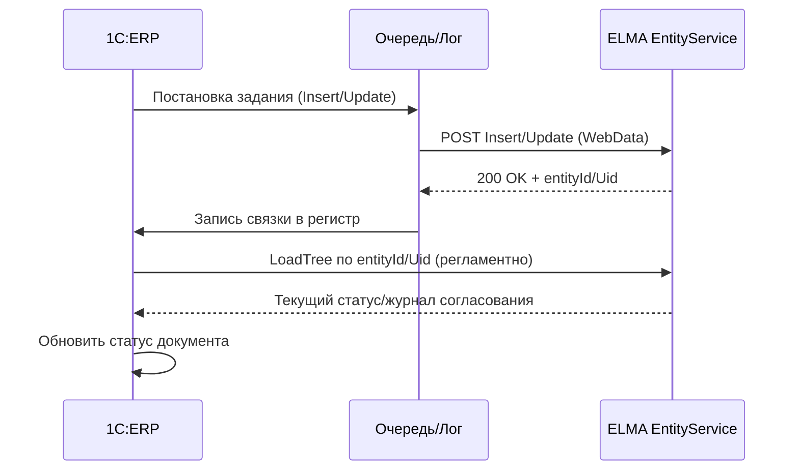

# PRD: Интеграция 1С:ERP ↔ ELMA

## «Приказ на установку цен» (создание процесса и обмен статусами)

---

## 1. Часть 1: Концепция / Назначение / Бизнес-ценность / Описание процесса

### 1.1 Назначение
1. Автоматически создавать в ELMA процесс **«Оформление приказа по организации»** при проведении документа 1С **«Установка цен номенклатуры»**.
2. Передавать ключевые реквизиты приказа и приложения (файлы печатных форм/таблиц цен).
3. Поддерживать явную команду **«Отправить в ELMA»** в форме документа (для администратора/ответственных).
4. Синхронизировать из ELMA статусы согласования/подписания обратно в 1С.

### 1.2 Бизнес-ценность
- Сокращение цикла утверждения новых цен на X%.
- Исключение ручных ошибок и дублей.
- Прозрачность статусов: «на согласовании», «согласован», «отклонен», «подписан/в силе».
- Аудит: в 1С хранится связка с ELMA и журнал интеграции.

### 1.3 Границы и среды
- **Источник:** 1С:ERP 2.5.17 (общепит + КТ‑2000 кастом).
- **Приемник:** ELMA, тип **Оформление приказа по организации**.
- **Среды:** Preprod (HTTP, отдельный токен), Prod (HTTPS, боевой токен).

### 1.4 Роли
- **Пользователь 1С** — оформляет и проводит документ «Установка цен».
- **Администратор 1С** — может переотправить документ в ELMA.
- **Интеграционный сервис 1С** — очередь, сериализация, ретраи, логирование.
- **ELMA** — хранит карточку приказа и управляет маршрутами согласования.

### 1.5 Процесс верхнего уровня
```mermaid
flowchart TD
A[1С: Документ 'Установка цен' проведен] --> B{Есть связка с ELMA?}
B -- Нет --> C[Insert в ELMA: создать приказ]
B -- Да --> D[Update в ELMA: обновить приказ]
C --> E[Сохранить связку (Id/Uid ELMA) в 1С]
D --> E
E --> F[Периодический опрос/LoadTree статусов из ELMA]
F --> G{Статус изменился?}
G -- Да --> H[Записать статус в документ 1С]
G -- Нет --> I[Ожидание/следующий цикл]
J[Кнопка 'Отправить в ELMA' (админ)] -->|форс| B
```

---

## 2. Часть 2: План технической имплементации

### 2.8 Что уже есть / что добавить
- **Уже есть**: —
- **Сделать**: новые серверный/клиент‑серверный/клиентский модули обмена; объект *СвязкиДокументовELMA*; команда формы; регламентные задания; маппинг «Установка цен → карточка приказа»; обратная синхронизация статусов; логирование; обработка **Cancel**.
### 2.9 Архитектура и логика (кратко)
- **Хранение токенов/учеток**: существующий регистр сведений **ПД_Дополнительный константы** (добавить ключи, ограничить права).
- **События/триггеры**: проведение документа → постановка в очередь Insert/Update; отмена проведения → постановка в очередь Cancel.
- **Команда формы**: «Отправить в ELMA» вызывает ту же процедуру отправки вне очереди.
- **Идемпотентность**: связка GUID документа ↔ Id/Uid ELMA в регистре *СвязкиДокументовELMA*.
- **Опрос статусов**: регламентно через Load/LoadTree, обновление поля статуса и журнала в 1С.
- **Без файлов и папок**: передаем только параметры (WebData), файлы формирует ELMA.

### 2.10 Варианты реализации
1. **Вариант A: REST EntityService (рекомендуется)**
   - Плюсы: стандартизованный WebData, единый контракт, простое чтение статусов.
   - Минусы: версионирование схемы на стороне ELMA, оговорки по файловым атрибутам.
2. **Вариант B: SOAP WSDL IEntityService**
   - Плюсы: строгая типизация.
   - Минусы: больше обвязки, сложнее отладка; не добавляет пользы против REST.
3. **Вариант C: Шлюз через промежуточный сервис**
   - Плюсы: кэш, троттлинг, единый аудит;
   - Минусы: дополнительный компонент.

---

## 3. Часть 3: Дополнительно (Безопасность, Ограничения, Риски)

### 3.1 Безопасность
- Токены/учетки — в защищенных константах 1С; доступ ограничен.
- Логи — исключать чувствительные данные; срок хранения согласовать.

### 3.2 Ограничения
- Лимиты ELMA на размер файлов (уточнить), лимиты частоты запросов.
- Формат дат: UTC или локальное время; согласовать единый стандарт.

### 3.3 Риски и меры
- **Дубли при повторах** — закрывается идемпотентностью на базе связки.
- **Несоответствие справочников** — требуется таблица соответствий UID для организаций/папок/типов приказов.
- **Большие вложения** — предусмотреть порог и дробную догрузку/сжатие.

---

## 4. Приложения

### 4.1 Диаграмма обмена


### 4.2 Таблица маппинга полей (минимум)

| 1С «Установка цен» | Тип | ELMA поле | Примечание |
|---|---|---|---|
| Организация | Справочник | Organization.Uid | через таблицу соответствий |
| Дата документа | Дата | Date | |
| Дата вступления в силу | Дата | StartDate | если используется |
| Номер документа | Строка | DecreeNumber | |
| Тема приказа | Строка | DecreeSubject | шаблонная строка |
| Тело приказа | Строка | DecreeHeadline | «Установить цены согласно приложению» |
| Пункты (цены) | Текст/ТЧ | DecreeContents[] | пары Number/Content |
| Тип приказа | Константа | DecreeType.Uid | «изменение в POS» |
| Папка | Справочник | Folder.Uid | опционально |
| Печать PDF | Файл | DecreeVersion / File | если доступно |

### 4.3 Тест-кейсы
1. Проведение документа → Insert, сохранение связки, статус «на согласовании» в 1С.
2. Кнопка «Отправить в ELMA» при существующей связке → Update без дубля.
3. Ошибка 401 (токен) → запись ошибки, повтор после исправления.
4. Загрузка файла > лимита → корректная ошибка, повтор без файла.
5. Статус ELMA «Отклонен» → фиксируем комментарий, блокируем публикацию цен.

---

## 5. Открытые вопросы (для подтверждения)
1. UID **DecreeType** для сценария «изменение в POS» подтверждаем? Нужны ли другие типы.
2. Нужна ли обязательная **Folder.Uid** и какая именно папка используется.
3. Перечень статусов, которые возвращаем в 1С, и где их хранить: одно поле **ELMA_Status** или развернутый журнал.
4. Что прикладываем как файлы: PDF печать, XLSX/CSV? Максимальные размеры и запрещенные типы.
5. Временная зона/формат дат для Date/StartDate.
6. Частота опроса статусов и порог ретраев.
7. Конкретный сетевой путь «папки хранения», срок ротации, права службы.
8. Модель безопасности: где хранить токены, кто имеет доступ.
9. Нужно ли при отмене проведения в 1С инициировать **отмену/аннулирование** приказа в ELMA.
10. Требуется ли доступ интеграционной учетке к справочникам Organization/Folder/Routes.

---

## 6. Definition of Done
- Настроены prod/preprod и проверены токены.
- Заполнена таблица соответствий (Organization/Folder/Type/Users).
- Реализованы: команда формы, очередь, Insert/Update, вложения, опрос статусов.
- Пройдены тест‑кейсы (п.4.3).
- Запущен мониторинг очереди и ретраи.

