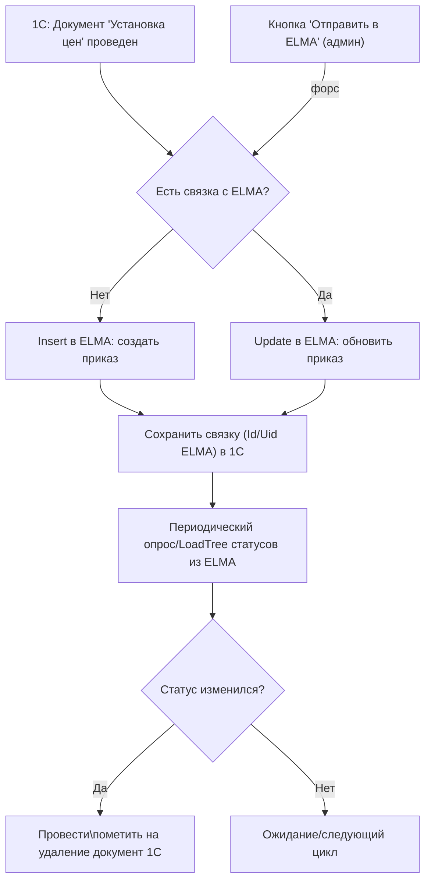
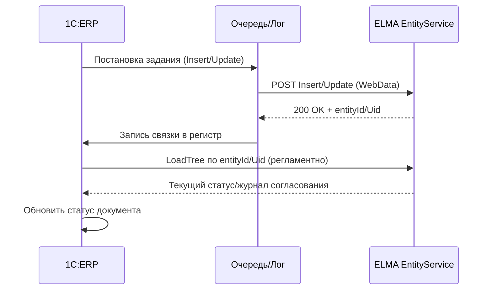

# PRD: Интеграция 1С:ERP ↔ ELMA

## «Приказ на установку цен» (создание процесса и обмен статусами)

**Версия:** 1.1 (обновлена структура API)  
**Дата обновления:** 18.11.2025

### Изменения в версии 1.1:
- Изменена структура запроса: добавлен ProcessToken и Context
- Organization: Uid вместо ИНН
- Initiator: Uid вместо Email
- DecreeHeadline вместо DecreeSubject
- DecreeContent (строка) вместо DecreeContents (массив)
- Добавлены поля: DecreeResponsible, NotificationUsr, FileDecree

---

## 1. Часть 1: Концепция / Назначение / Бизнес-ценность / Описание процесса

### 1.1 Назначение
1. Автоматически создавать в ELMA процесс **«Оформление приказа по организации»** при проведении документа 1С **«Установка цен номенклатуры»**.
2. Передавать ключевые реквизиты приказа и приложения (файлы печатных форм/таблиц цен).
3. Поддерживать явную команду **«Отправить в ELMA»** в форме документа (для администратора/ответственных).
4. Синхронизировать из ELMA статусы согласования/подписания обратно в 1С.

### 1.2 Бизнес-ценность
- Сокращение цикла утверждения новых цен на X%.
- Исключение ручных ошибок и дублей.
- Прозрачность статусов: «на согласовании», «согласован», «отклонен», «подписан/в силе».
- Аудит: в 1С хранится связка с ELMA и журнал интеграции.

### 1.3 Границы и среды
- **Приемник:** ELMA, тип **Оформление приказа по организации**.
- **Среды:** Preprod (HTTP, отдельный токен), Prod (HTTPS, боевой токен). http://10.21.180.147:8000

### 1.4 Роли
- **Пользователь 1С** — оформляет и проводит документ «Установка цен».
- **Администратор 1С** — может переотправить документ в ELMA.
- **Интеграционный сервис 1С** — очередь, сериализация, ретраи, логирование.
- **ELMA** — хранит карточку приказа и управляет маршрутами согласования.

### 1.5 Процесс верхнего уровня

---

## 2. Часть 2: План технической имплементации

### 2.8 Что уже есть / что добавить
- **Уже есть**: —
- **Сделать**: новые серверный/клиент‑серверный/клиентский модули обмена; объект *СтатусПроцессаЕЛМА*; команда формы; регламентные задания; маппинг «Установка цен → карточка приказа»; обратная синхронизация статусов; логирование; обработка **Cancel**.
### 2.9 Архитектура и логика (кратко)
- **Хранение токенов/учеток**: существующий регистр сведений **ПД_Дополнительный константы** (добавить ключи, ограничить права).
- **События/триггеры**: проведение документа → постановка в очередь Insert/Update; отмена проведения → постановка в очередь Cancel.
- **Команда формы**: «Отправить в ELMA» вызывает ту же процедуру отправки вне очереди.
- **Идемпотентность**: связка GUID документа ↔ Id/Uid ELMA в регистре *СтатусПроцессаЕЛМА*.
- **Опрос статусов**: регламентно через Load/LoadTree, обновление поля статуса и журнала в 1С.
- **Без файлов и папок**: передаем только параметры (WebData), файлы формирует ELMA.

### 2.10 Варианты реализации
1. **Вариант A: REST EntityService (рекомендуется)**
   - Плюсы: стандартизованный WebData, единый контракт, простое чтение статусов.
   - Минусы: версионирование схемы на стороне ELMA, оговорки по файловым атрибутам.
2. **Вариант B: SOAP WSDL IEntityService**
   - Плюсы: строгая типизация.
   - Минусы: больше обвязки, сложнее отладка; не добавляет пользы против REST.

---

## 3. Часть 3: Дополнительно (Безопасность, Ограничения, Риски)

### 3.1 Безопасность
- Токены/учетки — в защищенных константах 1С; доступ ограничен.
- Логи — исключать чувствительные данные; срок хранения согласовать.

### 3.2 Ограничения
- Лимиты ELMA на размер файлов (уточнить), лимиты частоты запросов.
- Формат дат: UTC или локальное время; согласовать единый стандарт.

### 3.3 Риски и меры
- **Дубли при повторах** — закрывается идемпотентностью на базе связки.
- **Несоответствие справочников** — требуется таблица соответствий UID для организаций/папок/типов приказов.
- **Большие вложения** — предусмотреть порог и дробную догрузку/сжатие.

---

## 4. Приложения

### 4.1 Диаграмма обмена

### 4.2 Таблица маппинга полей (минимум)

| 1С «Установка цен» | Тип | ELMA поле | Примечание |
|---|---|---|---|
| — | Константа | ProcessToken | Константа процесса ELMA (262d1c28-1711-4e9d-b65c-65d8ed8c0d68) |
| Организация | Справочник | Organization.Uid | Uid организации из ELMA (через таблицу соответствий) |
| Пользователь | Справочник | Initiator.Uid | Uid пользователя (физ.лица) из ELMA |
| — | Константа | DecreeType.Uid | Uid типа приказа из ELMA (571c78cc-baa0-4529-a00f-8e6c65790ae7) |
| Тема приказа | Строка | DecreeHeadline | Шаблонная строка: «Об установке цен для {Организация} с {Дата}» |
| Преамбула | Строка | Preamble | «В целях актуализации прейскуранта» |
| Содержание приказа | Строка | DecreeContent | Объединенное содержание всех пунктов приказа |
| Дата вступления в силу | Дата | StartDate | Дата начала действия цен |
| Ответственный | Справочник | DecreeResponsible.Uid | Uid ответственного за исполнение из ELMA |
| Ознакомить | Справочник | NotificationUsr[].Uid | Массив Uid пользователей для ознакомления |
| Печатная форма DOCX | Файл | FileDecree | Файл Word в формате base64 |

### 4.3 Тест-кейсы
1. Проведение документа → Insert, сохранение связки, статус «на согласовании» в 1С.
2. Кнопка «Отправить в ELMA» при существующей связке → Update без дубля.
3. Ошибка 401 (токен) → запись ошибки, повтор после исправления.
4. Загрузка файла > лимита → корректная ошибка, повтор без файла.
5. Статус ELMA «Отклонен» → фиксируем комментарий, блокируем публикацию цен.

---

## 5. Открытые вопросы (для подтверждения)
1. **ProcessToken** = `262d1c28-1711-4e9d-b65c-65d8ed8c0d68` — подтвержден?
2. **DecreeType.Uid** = `571c78cc-baa0-4529-a00f-8e6c65790ae7` для приказов на установку цен — подтвержден?
3. Обязательность полей **DecreeResponsible** и **NotificationUsr** — всегда ли они должны быть заполнены?
4. Формат файла **FileDecree**: только DOCX или допустимы PDF/другие форматы? Максимальный размер файла?
5. Временная зона для **StartDate**: UTC (Z) или локальное время сервера?
6. Перечень статусов процесса ELMA, которые будут возвращаться в 1С для синхронизации.
7. Как заполнить таблицу соответствий **MRS_СоответствияОбъектовELMA**:
   - Организации: вручную или импорт из ELMA?
   - Пользователи: автоматическая синхронизация или ручной ввод?
8. Частота опроса статусов процессов и порог повторных попыток при ошибках.
9. Модель безопасности: где хранить ProcessToken, AuthToken, права доступа.
10. Поведение при повторной отправке: создавать новый процесс или обновлять существующий?
11. Что делать при отсутствии соответствия для организации/пользователя в таблице MRS_СоответствияОбъектовELMA?

---

## 6. Definition of Done
- Настроены prod/preprod URL и проверены токены (ApplicationToken, AuthToken).
- Настроены константы: ProcessToken, DecreeTypeUid.
- Создан и заполнен регистр соответствий **MRS_СоответствияОбъектовELMA**:
  - Организации (Organization.Uid)
  - Пользователи (Initiator.Uid, DecreeResponsible.Uid)
  - Пользователи для ознакомления (NotificationUsr)
- Реализованы общие модули:
  - Функции авторизации в ELMA
  - Функции получения Uid из таблицы соответствий
  - Формирование JSON с ProcessToken и Context
  - Генерация и конвертация DOCX в Base64
  - Отправка через /API/REST/Process/StartWithData
  - Опрос статусов процессов
- Реализована форма документа "Установка цен номенклатуры":
  - Команда "Отправить в ELMA"
  - Отображение статуса процесса ELMA
  - История интеграции
- Настроены регламентные задания:
  - Обработка очереди отправки (каждые 5 минут)
  - Опрос статусов процессов (каждые 15 минут)
- Пройдены тест-кейсы (п.4.3).
- Запущен мониторинг очереди, ретраи и логирование ошибок.

